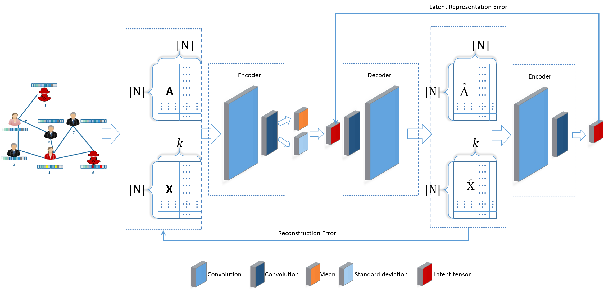
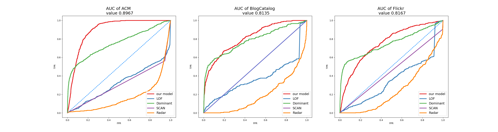

·

# VGAEE

Implementation code of the algorithm described in paper "Anomaly node detection method based on variational auto-encoder in attribute network". 

  

## Abstract 

The attribute network can be seen everywhere in real life. Different from the plane network, the nodes or edges in the attribute network contain rich attribute information. In recent years, the detection of abnormal nodes in attribute networks has attracted more and more attention. The abnormal nodes in attribute networks refer to the fact that the structural characteristics or attribute information of nodes are different from most normal nodes in the network, so that the nodes are more likely to be generated by different generation mechanisms. Attribute network abnormal node detection has important practical significance, for example, it can be used for social network bot account detection, false evaluation account detection, false information manufacturing account detection, and so on. A large number of scholars have done a lot of research on the detection of abnormal nodes in plane networks, but they are limited to using the structural information of the network. Graph neural network provides a new method for attribute network data mining by combining structural information and attribute information. However, the current unsupervised attribute network anomaly node detection based on graph auto-encoder can not capture the sub-features of normal nodes, which leads to a high false negative rate. A method based on variational auto-encoder is proposed to detect abnormal nodes in attribute networks. Normal nodes composed of normal node features are identified as normal nodes by using reconstruction error as the anomaly measurement of nodes. Experiments on real network data sets show that this method can effectively detect abnormal nodes in attribute networks. 

## Experimental results  

  

  

  

  

## Experimental results  
python==3.6
TensorFlow 1.10

## Acknowledgement
 - This code is heavily borrowed from [Kaize Ding et al.](https://github.com/kaize0409/GCN_AnomalyDetection)
 - The baseline code is heavily borrowed from [LinghaoChan.](https://github.com/LinghaoChan/Awesome-anomaly-detection-baseline)

